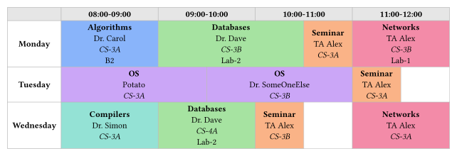
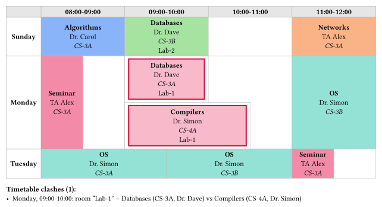
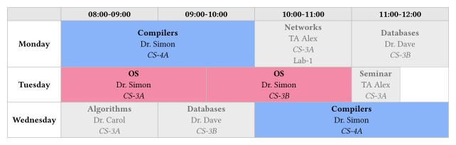
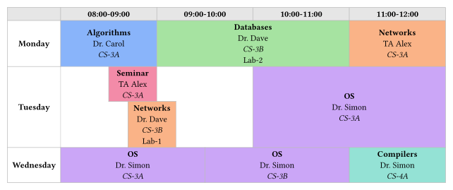
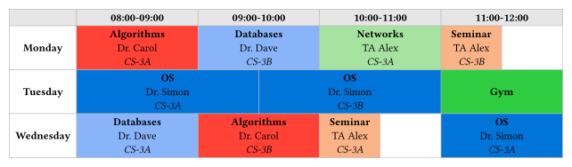

# Roster

roster is a time table thingy made in typst, I am sure there is a lib in python
that does that same, but I did not look for it, I wanted a typst one

one cool thing about roster is that ~I don't remember why I choose that name~,
just figured out that roster literally is a sort of timetable

you have an [example](./example/example.typ) if you want to use it

lmk if you need help with anything

## Use

Install via

```sh
just install
```

you can run it if you don't have just but honestly why don't you have just?

here is a small example too

```typ
#import "@local/roster:0.1.0": timetable, entry

#timetable(
  slots: ("08:00-09:00", "09:00-10:00"),
  days: ("Monday",),
  n-slots: 2,
  schedule: (Monday: (entry("Math", "Dr. Carol", "CS-3A", slot: 0),)),
)
```

## What it looks like

normal colored table:



a clash gets red boxes plus a report:



focus dims everything except one teacher (you can also focus by group or subject
or room):



overlapping sessions just get their own lane:



named palette pins colors by value, the rest go auto:



## License

it is MIT
